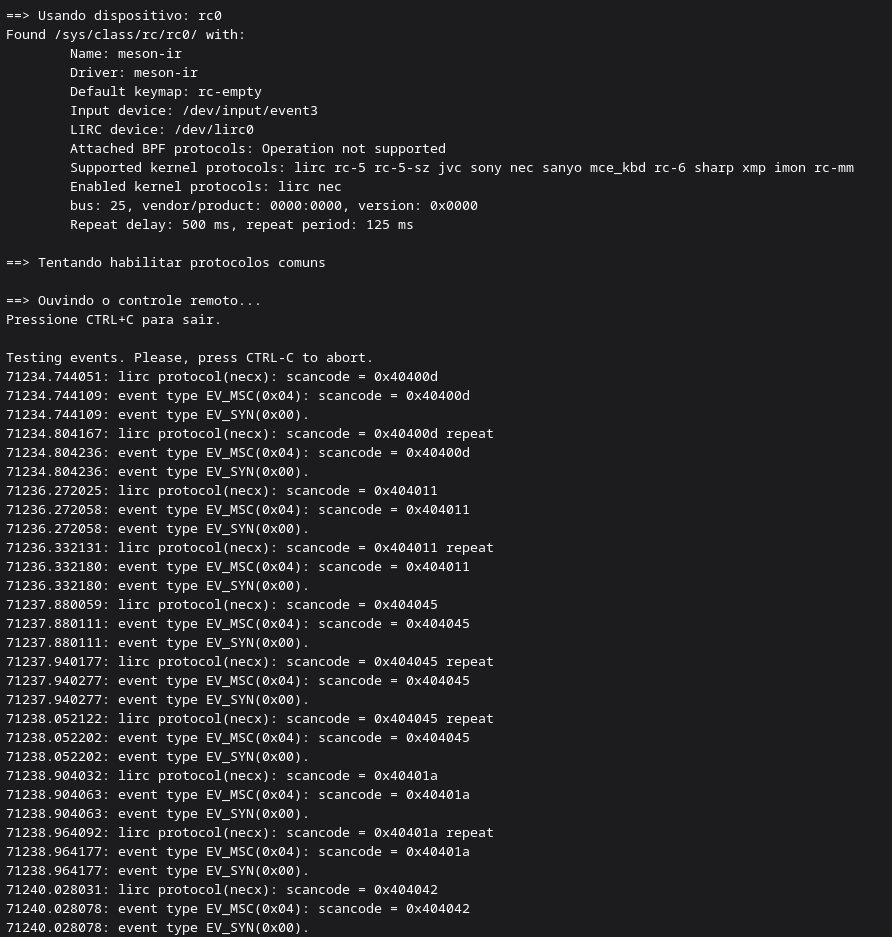
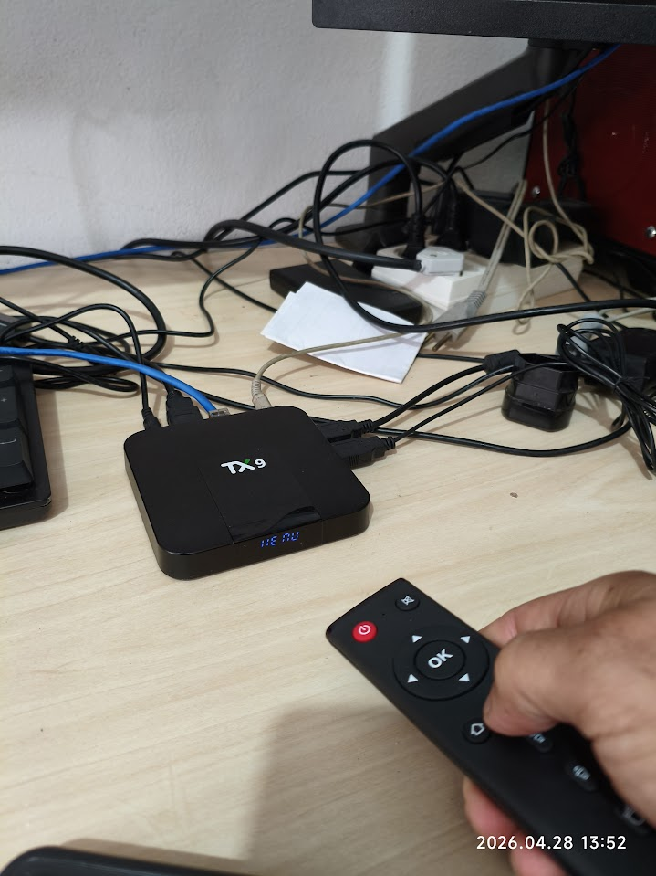
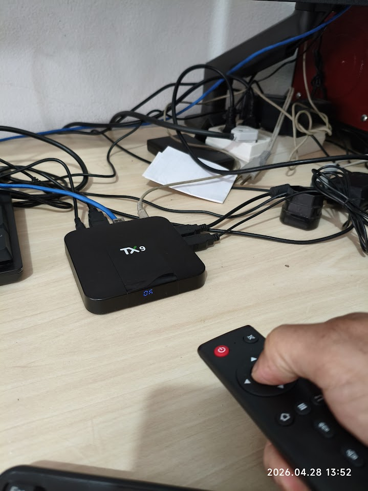
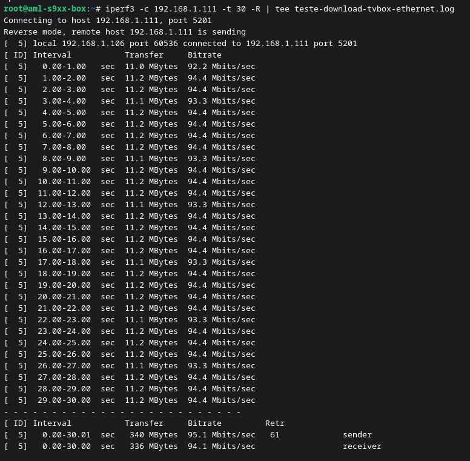
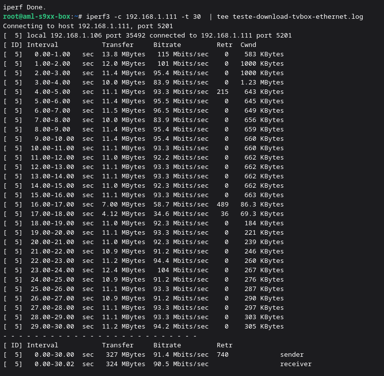

# Relatório Técnico: Transformação e Descaracterização de TV Box TX9 para Armbian Linux

Este relatório descreve o processo descaracterização de tvbox  TX9 Pro com Android embarcado para Armbian (Linux) tentando manter a funcionalidade do componetes de hardware do dispostivo, o maior problema dessas mudanças de sistemas desse tipo de dispotivo embarcado.  Os tvbox foram disponibilizados pela Receita Federal do Brasil, são obtidos através de processos de apreensão e destinação de bens, esses dispositivos muitas vezes são utilizado para reprodução de contúdos multimídia  não autorizados, além disso podem oferecer riscos de segurança devido a vulnerabilidades ou até há presença de software malicioso. O processo de descaracterização visa eliminar essas vulnerabilidades, garantindo que o dispositivo seja seguro para uso institucional e não possa ser facilmente revertido ao estado original ou explorado por terceiros.
Nas analise iniciais do firmware Android embarcado no dispositivo, foram identificados processos estranhos em execução em segundo plano com privilégios de root, e o sistema de arquivos estava montado como leitura e escrita, o que representa um risco de segurança significativo.  Alguns desses processos podem ser de controle de hardware específico como Infravermelho, Display frontal, masmbém podem ser relacionados a monitoramento de uso ou até mesmo backdoors, e a migração para um sistema Linux customizado permite que tenhamos controle total sobre o software em execução, eliminando quaisquer componentes indesejados ou potencialmente maliciosos presentes no firmware original do Android. Por isso, a mera implantação de aplicações de terceiros ou a instalação de uma camada de compatibilidade sobre o Android não seria suficiente para garantir a segurança e a funcionalidade desejada, pois o sistema ainda estaria sujeito às vulnerabilidades e limitações do firmware original. 
O fato do sistema Android estar com usuário root disonivel para uso, facilitou a obtenções de informações críticas sobre o hardware e o firmware, como a extração do Device Tree Blob (DTB) e a análise dos processos em execução, o que foi fundamental para o desenvolvimento dos drivers personalizados e a configuração do kernel Linux para garantir a compatibilidade total com os componentes específicos do TX9 Pro.


---

## 1. Resumo do que foi feito
Inicialmete realizamos uma inspesão visual no hardware do dispositivo, identificando os principais componentes, como o SoC Amlogic S905W, o chip de controle do display FD650 e o módulo Wi-Fi baseado no chipset SSV6051. Em seguida, realizamos uma análise detalhada do firmware Android embarcado utilizando o utilitário ADB para extrair informações críticas sobre o sistema, incluindo a estrutura de boot, os processos em execução e a identificação dos componentes de hardware. Figura 1  mostra a placa do dispositivo com os principais componentes destacados.

Em seguida  realizamos a extração do Device Tree Blob (DTB) diretamente do dispositivo utilizando ADB, o que foi facilitado devido ao usuário root disponível, e depois descompilamos o arquivo para obter um arquivo de texto legível, onde pudemos identificar os componentes e suas conexões. O DTB é um arquivo binário que descreve a estrutura de hardware do dispositivo, incluindo os componentes conectados e suas interconexões. Ele é usado pelo kernel Linux para entender como interagir com o hardware específico do dispositivo. No caso do TX9, o DTB continha informações cruciais sobre o SOC Amlogic S905W, o chip de controle do display FD650 e o módulo Wi-Fi baseado no chipset SSV6051.

### 1.1. Análise do Bootloader e Processos em Execução
- **Comando:** `adb shell ps -A` -> Identificou processos com privilégios de root, incluindo `init`, `surfaceflinger`, `hwservicemanager` e outros relacionados a controle de hardware específico (ex: `ir_remote`, `vfd_display`).
- **Comando:** `adb shell mount` -> Revelou que o sistema de arquivos estava montado como leitura e escrita (`rw`), indicando uma configuração insegura.
- **Comando:** `adb shell cat /proc/cpuinfo` -> Confirmou a presença de um SoC Amlogic S905W, com CPU ARM Cortex-A53 e GPU Mali-450 MP, rodando um kernel Linux 3.14.29.

### 1.2. Identificação da Plataforma e Modelo
Para determinar o chipset e o fabricante original, utilizamos as propriedades do sistema Android (Build Props):
- **Comando:** `adb shell getprop | grep -iE 'product.model|board.platform|hardware'`
- **Resultado:** O parâmetro `ro.board.platform: gxl` confirmou tratar-se da família **Amlogic S905W/X**, que utiliza a arquitetura GXL.

### 1.3. Detecção da GPU (Mali-450 MP)
A identificação da GPU foi realizada através de três frentes:
1.  **Módulos do Kernel:** Executamos `lsmod` para verificar drivers carregados. O módulo `mali` estava presente e sendo utilizado por 35 processos.
2.  **Logs do Kernel:** O comando `dmesg | grep -i mali` confirmou a inicialização do driver de vídeo.
3.  **Correlação de Chipset:** Como a plataforma foi identificada como `gxl` (Amlogic S905W), a GPU padrão integrada neste SoC é a **ARM Mali-450 MP (Penta-core)**.

### 1.4. Mapeamento de Conectividade (Wi-Fi e Ethernet)
A maior dificuldade em trocar firmwares de TV Box é a perda do Wi-Fi. Identificamos o chip exato para evitar este problema:
- **Comando:** `adb shell su -c "dmesg | grep -iE 'wifi|wlan0|ssv|rtl'"`
- **Evidência:** Os logs mostraram funções como `ssv6200_sw_scan_start()` e o comando `lsmod` listou o módulo `ssv6051`.
- **Conclusão:** O chipset de Wi-Fi é o **South Silicon Valley (SSV) 6051/6200**, um chip de baixo custo que exige drivers específicos no kernel.

### 1.5. Localização e Extração do DTB (Device Tree Blob)
O DTB é o "mapa" que diz ao kernel onde cada componente de hardware está.
- **Tentativa 1:** Busca por assinatura hexadecimal `d00dfeed` no `boot.img`. (Sem sucesso, indicando que o DTB não estava concatenado no final do kernel).
- **Tentativa 2:** Verificação de `/sys/firmware/fdt`. (Acesso negado pelo kernel 3.14).
- **Sucesso:** Extração direta do dispositivo de bloco via `adb shell su -c "dd if=/dev/dtb of=/sdcard/dtb.img"`. Este método captura o binário que o bootloader entrega ao kernel em tempo de execução.
#### 1.5.1 Extração de Partições via ADB
Utilizando o dispositivo ainda com Android, foram extraídas as imagens críticas para análise:
```bash
# Extração do Device Tree Blob (DTB) original
adb shell dd if=/dev/block/dtb of=/sdcard/android_tx9.dtb
adb pull /sdcard/android_tx9.dtb .
```

#### 1.5.2 Engenharia Reversa do DTB
O arquivo `.dtb` (binário) foi descompilado para `.dts` (texto legível) para identificação dos endereços de memória e pinagens (GPIO):
```bash
# Descompilação para análise de hardware
dtc -I dtb -O dts android_tx9.dtb -o extracted.dts
```

## 1.6.  Versão do Android (Fake vs Real)
Detectamos que o sistema mentia sobre sua versão (reportava Android 10):
- **Comando:** `adb shell getprop ro.build.version.release` -> Retornava `10`.
- **Comando:** `adb shell uname -a` -> Retornava kernel `3.14.29`.
- **Comando:** `adb shell getprop ro.build.fingerprint` -> Revelou a build `7.1.2/NHG47L`.
- **Conclusão:** O kernel 3.14 é incompatível com o Android 10 real; o dispositivo roda um **Android 7.1.2 (Nougat)** mascarado.

## 1.7. Mapeamento de Partições
Utilizamos o sistema de arquivos `/dev/block/platform/` para entender a estrutura da EMMC:
- **Comando:** `adb shell ls -R /dev/block/platform/d0074000.emmc/`
- **Identificação:** Localizamos as partições críticas `boot`, `recovery`, `logo`, `reserved` e `rsv`, permitindo o backup cirúrgico de cada uma via `dd`.


Por fim nessa Analinicial identificamos o modelo do dispositivo, o chipset, a GPU, o controlador de Wi-Fi e a estrutura de partições, o que foi fundamental para planejar a migração para Armbian e garantir a compatibilidade total com o hardware específico do TX9 Pro.
Os arquivos extraídos foram:
/analises/tx9_pro_dump_android/  com os seguintes arquivos:
- **boot.img**: Imagem de inicialização original contendo o kernel (v3.14.29) e o ramdisk do Android 7.1.2.
- **dtb.img**: Binário crítico do Device Tree Blob extraído de `/dev/dtb`, que contém o mapeamento de hardware para o SoC Amlogic.
- **logo.img**: Partição contendo as imagens de splash screen e recursos visuais de boot do fabricante.
- **recovery.img**: Imagem da partição de recuperação stock do dispositivo.
- **extracted.dts**: Código-fonte descompilado do DTB, essencial para identificar as pinagens de GPIO utilizadas pelo display e Wi-Fi.

o arquivo dts continha informações cruciais sobre o SOC Amlogic S905W, o chip de controle do display FD650 e o módulo Wi-Fi baseado no chipset SSV6051, incluindo os pinos de comunicação e os endereços de memória necessários para configurar o kernel Linux para reconhecer e interagir com esses componentes. Por exemplo, identificamos quais pinos GPIO estavam conectados ao chip de controle do display e ao módulo Wi-Fi, o que nos permitiu configurar o kernel para usar esses pinos corretamente. Sem essa análise detalhada do DTB, seria extremamente difícil garantir a compatibilidade do kernel Linux com o hardware específico do TX9, e muitos dos recursos do dispositivo poderiam não funcionar corretamente após a migração para Armbian, como os trechos a seguir mostram:

### 1.7.1. Mapeamento do Display Frontal (FD650/FD6551)
O display utiliza uma técnica de bit-bang sobre pinos GPIO. No DTS, primeiro definimos os pinos no controlador de GPIO e depois configuramos o nó do dispositivo.
```dts
&gpio {
    &gpio {
    /* Definição dos pinos físicos para o protocolo serial do display */
    fd650_clk: fd650_clk {
        amlogic,pins = "GPIOX_27"; // Pino 27 do banco X para Clock
        phandle = <0x20>;
    };
    fd650_dio: fd650_dio {
        amlogic,pins = "GPIOX_29"; // Pino 29 do banco X para Dados (bidirecional)
        phandle = <0x21>;
    };
};

```
### 1.7.2. Mapeamento do Wi-Fi (SSV6051)


```
&gpio {
    /* Pino de controle de energia/reset do módulo Wi-Fi */
    wifi_ctrl: wifi_ctrl {
        amlogic,pins = "GPIOX_28"; // Pino 28 do banco X
        phandle = <0x22>;
    };
};

&ssv6051 {
    compatible = "ssv,ssv6051";
    reg = <0x00 0xc8100000 0x00 0x1000>; // Endereço de hardware para o controlador Wi-Fi
    interrupts = <0x00 0x2c>;           // Interrupção de hardware (IRQ)
    status = "okay";
    pinctrl-0 = <0x22>;                 // Referência ao pino de controle
};
```


#### 1.7.3. Mapeamento do Receptor Infravermelho (IR)
Esses trechos do arquivo `.dts` mostram a configuração dos pinos GPIO para o controle do display FD650 e do módulo Wi-Fi SSV6051, bem como os endereços de memória e as interrupções associadas a cada componente. Essa configuração é essencial para que o kernel Linux possa interagir corretamente com o hardware específico do TX9 Pro após a migração para Armbian.

### Resumo das Pinagens Encontradas:
|Componente | Pino GPIO | Endereço de Memória | Observações |
|-----------|-----------|---------------------|-------------|
| Display (FD650) | GPIOX_27 (CLK), GPIOX_29 (DIO) | 0xC8834000 | Protocolo bit-bang proprietário |
| Wi-Fi (SSV6051) | GPIOX_28 (Controle) | 0xC8100000 | Driver proprietário, IRQ 0x2c |
| IR (Receptor) | GPIOAO_7 | 0xC8100580 | Driver `meson-ir`, IRQ 0xc4 |


Com conhecimento parcial do hardware e do firmware original, foi possível planejar a migração para Armbian, buscando um kernel linux fosse configurado corretamente para reconhecer e interagir com os componentes específicos do TX9 Pro, como o display frontal, o módulo Wi-Fi e o receptor infravermelho. Essa etapa de análise detalhada foi fundamental para o sucesso da migração e para garantir a funcionalidade total do dispositivo após a instalação do novo sistema operacional.


## 3. Fase 2: Instalação do Sistema Operacional (Armbian)
A escolha do Armbian deve-se à sua em sistemas ARM e suporte à comunidade Amlogic S905W. O processo de instalação envolveu a preparação do bootloader e a migração para a memória interna (eMMC). Buscamos então imagens pré-compiladas do Armbian para o S905W, os dtbs que acompanham a imagem do Armbian são compativeis com parte do mas não possuem todo o mapeamento, utilizamos o DTB meson-gxl-s905w-tx9.dtb, que é o mais próximo do nosso hardware, e foi necessário realizar ajustes manuais para garantir a compatibilidade total com o display, Wi-Fi e IR. O processo de migração para a eMMC foi automatizado através de scripts personalizados, garantindo uma transição suave do ambiente de boot via SD para a memória interna.

Na internet são encontrdas diversas imagens para o S905W, mas a maioria delas são para tvbox genéricos, e não possuem o mapeamento completo do hardware do TX9 Pro, o que resultaria em perda de funcionalidades críticas como o display frontal e o Wi-Fi.  Optamos pela imagem disponível no repositório da comunidade Armbian, que é mantida por entusiastas e desenvolvedores que frequentemente atualizam os DTBs para suportar uma variedade de dispositivos baseados no S905W. A imagem utilizada para teste foi a `Armbian_community_26.2.0-trunk.703_Aml-s9xx-box_noble_current_6.18.21_xfce_desktop.img.xz`, que inclui um kernel Linux atualizado (6.18.21) e suporte para o ambiente de desktop XFCE, proporcionando uma base sólida para o desenvolvimento dos drivers personalizados e a configuração do sistema.

Alguns links para download da imagem Armbian para Amlogic S905W:

#Download da imagem do Armbian para S905W
#Download imagem  Armbian para Amlogic S905W 
links para download da imagem Armbian para Amlogic S905W:
 https://fi.mirror.armbian.de/cache/artifacts/aml-s9xx-box/archive/
Imagem utilizada para teste: Armbian_community_26.2.0-trunk.703_Aml-s9xx-box_noble_current_6.18.21_xfce_desktop.img.xz.torrent


https://dl.armbian.com/odroid-c2/archive/Armbian_22.08.0_Odroidc2_buster_current_5.10.60.img.xz


https://github.com/armbian/community/releases


https://armbian.com/boards/aml-s9xx-box


### 3.1 Preparação do Bootloader
Foi utilizado um cartão SD configurado com o script `uEnv.txt` apontando para o DTB correto (`meson-gxl-s905w-tx9.dtb`), permitindo o boot inicial forçado.

### Boot via SD Card 
O cartão SD foi preparado com a imagem do Armbian e um arquivo `uEnv.txt` personalizado para forçar o uso do DTB específico para o TX9 Pro:
```text
# /boot/uEnv.txt
dtb_name=meson-gxl-s905w-tx9.dtb
bootargs=console=ttyAML0,115200n8 root=/dev/mmcblk 
0p1 rootwait rw
```
em seguida, o dispositivo foi inicializado a partir do cartão SD, permitindo a validação do sistema operacional e a configuração inicial antes de migrar para a memória interna (eMMC).


### 3.2 atualização do kernel
A atualização do kernel foi realizada do kernel **6.18.21** para **6.18.23-current-meson64** .

```bash
# Atualização do kernel para a versão mais recente
sudo apt update
sudo apt install linux-image-current-meson64 linux-headers-current-meson64
```


### 3.2 Migração para Memória Interna (eMMC)
Após a validação via SD, o sistema foi transferido para a memória interna utilizando scripts de automação como o `install_armbian.sh`:
```bash
# Execução do script de instalação na eMMC
sudo ./install_armbian.sh
```

---

## 4.  Configuração de Drivers Personalizados e Serviços de Hardware do TX9 

A maior complexidade técnica residiu no suporte ao hardware proprietário ou legado utilizados nos tvbox como é o caso do wifi que não possuim desenvolvimento ativo, e do display frontal que utiliza um protocolo proprietário de bit-bang via GPIO. Essas peculiaridades exigiram uma abordagem de engenharia reversa para mapear o hardware e desenvolver drivers personalizados, garantindo a funcionalidade total do dispositivo após a migração para Armbian. A falta de documentação oficial e o suporte limitado da comunidade para esses componentes específicos.


### 4.1 Driver Wifi SSV6051
Um dos principais desafios da migração da TV Box TX9 Pro para Armbian foi manter o funcionamento do Wi-Fi integrado. Durante a análise inicial do firmware Android original, foi identificado que o módulo sem fio utilizava o chipset **South Silicon Valley SSV6051/SSV6200**, evidenciado pelos logs do kernel e pela presença do módulo `ssv6051` no sistema Android original.

Esse chipset não possui suporte nativo estável nos kernels Linux mainline atuais. Por isso, foi necessário compilar um driver externo, isto é, um módulo *out-of-tree*, específico para o kernel utilizado no Armbian. Isso possívelmente é o motivo pelo qual os outros projetos de migração de firmware para o TX9 Pro encontrados na internet não conseguiram manter o Wi-Fi funcional, pois não realizaram a engenharia reversa necessária para compilar um driver compatível com o kernel Linux moderno utilizado no Armbian.

A dificuldade principal ocorreu porque os drivers disponíveis para o SSV6051 são legados, originalmente desenvolvidos para versões antigas do kernel Linux, próximas da série 3.x, enquanto a imagem Armbian utilizada no TX9 Pro empregava um kernel moderno da família **6.x meson64**. Assim, não bastava copiar o módulo do Android ou tentar carregar um driver genérico: foi necessário localizar um código-fonte compatível, adaptar a compilação aos cabeçalhos do kernel atual e garantir que o módulo gerado apresentasse a mesma assinatura de versão exigida pelo kernel em execução.

Nas buscas encontrasmos diversos repositórios, alguns com códigos quebrados ou desatualizados, mas o mais completo e atualizado foi o repositório de Eloi Rotava, que continha o código-fonte parcialmente atualizado do driver para o SSV6051, e a partir desse código-fonte, realizamos as modificações necessárias para garantir a compatibilidade com o kernel Linux utilizado no Armbian. O processo de compilação envolveu a instalação das dependências necessárias, a configuração dos arquivos de cabeçalho do kernel para garantir a compatibilidade e a execução do processo de compilação para gerar o módulo `ssv6051.ko`, que foi então carregado no sistema para habilitar a funcionalidade Wi-Fi, permitindo que o dispositivo se conectasse a redes sem fio e tivesse acesso à internet.

### 4.1.2 Correção do problema de *version magic*

Durante os testes, foi identificado que o processo padrão de instalação dos headers do Armbian nem sempre gerava corretamente a string completa de versão esperada pelo kernel. Isso causava erro de incompatibilidade no carregamento do módulo, mesmo quando o código compilava sem falhas.

Para corrigir esse problema, foi necessário ajustar manualmente o `EXTRAVERSION` no `Makefile` dos headers e recriar o arquivo `utsrelease.h`, garantindo que o módulo `ssv6051.ko` fosse compilado com a mesma identificação de versão do kernel ativo.

```bash
KVER=$(uname -r)
HDIR="/usr/src/linux-headers-$KVER"

sed -i 's/^EXTRAVERSION =.*/EXTRAVERSION = -current-meson64/' $HDIR/Makefile

echo "#define UTS_RELEASE \"$KVER\"" > $HDIR/include/generated/utsrelease.h
```

Essa etapa foi crítica para resolver o erro de *version magic*, permitindo que o kernel aceitasse o módulo compilado localmente.

### 4.1.3 Compilação do módulo `ssv6051.ko`

Com os headers corrigidos, o código-fonte do driver foi compilado diretamente na TV Box. Para tornar o processo reprodutível, foi utilizado o script `rebuild_wifi_v3.sh`, responsável por limpar compilações anteriores, compilar o driver, instalar o módulo no diretório correto do kernel e atualizar as dependências de módulos.

```bash
bash /root/ssv6051-driver/rebuild_wifi_v3.sh
```

O script executa, em sequência, os seguintes passos:

1. valida a existência dos headers do kernel ativo;
2. acessa o diretório do driver `ssv6051`;
3. executa `make clean`;
4. compila o módulo `ssv6051.ko`;
5. copia o módulo para `/lib/modules/$(uname -r)/kernel/drivers/net/wireless/ssv6051/`;
6. executa `depmod -a`;
7. carrega o driver com `modprobe ssv6051`.

Com isso, o Wi-Fi passou a ser reconhecido pelo sistema como interface `wlan0`.

### 4.1.4 Instalação dos arquivos de firmware

Além do módulo do kernel, o chipset SSV6051 depende de arquivos auxiliares de firmware e configuração. Esses arquivos precisaram ser copiados manualmente para `/lib/firmware/`, pois o driver os procura nesse diretório durante a inicialização.

```bash
cp /root/ssv6051-driver/6051/ssv6xxx/ssv6051-wifi.cfg /lib/firmware/ssv6051-wifi.cfg
cp /root/ssv6051-driver/6051/ssv6xxx/ssv6051-sw.bin /lib/firmware/ssv6051-sw.bin
```

Sem esses arquivos, o módulo até poderia ser carregado, mas a interface sem fio não inicializaria corretamente.

### 4.1.5 Carregamento automático no boot

Para garantir que o driver fosse carregado automaticamente após cada reinicialização, foi criada uma configuração em `/etc/modules-load.d/`.

```bash
echo 'ssv6051' > /etc/modules-load.d/ssv6051.conf
```

Esse procedimento evita a necessidade de executar `modprobe ssv6051` manualmente a cada boot e garante que o dispositivo Wi-Fi esteja disponível antes da configuração da rede pelo NetworkManager.

### 4.1.6 Correção de estabilidade: desativação do power management

Durante os testes, observou-se que o Wi-Fi apresentava instabilidade, quedas de conexão e comportamento intermitente. A causa mais provável foi o modo de economia de energia da interface sem fio. Para evitar esse problema, foi criado um script no dispatcher do NetworkManager para desativar automaticamente o `power_save` sempre que a interface `wlan0` fosse ativada.

```bash
cat <<EOF > /etc/NetworkManager/dispatcher.d/99-ssv6051-fix
#!/bin/sh
INTERFACE=\$1
ACTION=\$2

if [ "\$INTERFACE" = "wlan0" ] && [ "\$ACTION" = "up" ]; then
    /usr/sbin/iw dev wlan0 set power_save off
fi
EOF

chmod +x /etc/NetworkManager/dispatcher.d/99-ssv6051-fix
```

Essa configuração aumentou a estabilidade da conexão e impediu que o gerenciamento de energia desligasse ou colocasse o chipset em um estado instável durante o uso.

### 4.1.7 Configuração da rede sem fio

Com o módulo carregado e o firmware instalado, a conexão Wi-Fi pôde ser configurada pelo NetworkManager usando `nmcli`.

```bash
nmcli device wifi rescan
nmcli device wifi connect 'NOME_DA_REDE' password 'SENHA_AQUI'
nmcli connection modify 'NOME_DA_REDE' connection.autoconnect yes
```

Dessa forma, a TV Box passou a se conectar automaticamente à rede sem fio após o boot.

### 4.1.8 Validação final

Após a compilação, instalação e configuração do driver, foram realizados testes para confirmar o funcionamento do Wi-Fi:

```bash
uname -r
lsmod | grep ssv6051
ip addr show wlan0
iw dev wlan0 get power_save
```

A validação consistia em confirmar que:

- o kernel ativo era o esperado;
- o módulo `ssv6051` estava carregado;
- a interface `wlan0` havia recebido endereço IP;
- o modo de economia de energia estava desativado.

    ```

### 4.2 Driver do Display Frontal (FD650)
O display frontal do TX9 Pro é controlado por um chip FD6551 (ou variante compatível sem documentação pública), que utiliza um protocolo serial síncrono proprietário de 2 fios (CLK + DIO open-drain) implementado via GPIO bit-bang. Diferentemente do I2C padrão usados comumente em dispositivos embarcados com arduino, esp e similares. Esse protocolo não utiliza endereçamento de dispositivo nem framing complexo: cada transação consiste em uma condição de START, um byte de endereço de registrador interno, um byte de dado e uma condição de STOP, com o nono ciclo de clock reservado para ACK.

Inicialmente foi necessário identificar os pinos GPIO corretos conectados ao chip de controle do display, o que foi feito por meio de testes práticos e no conhecimento superfical do DTB, foi escrito um código em Python para enviar sinais de clock e dados via GPIO, e a pinagem em busca do padrão dos bits de controle do display. Mas nos boots iniciais, o display não respondia, o que levou a uma investigação mais aprofundada. A configuração inicial assumida com base no DTB genérico `p281` indicava os pinos GPIOX_27 e GPIOX_29 para clock e dados, respectivamente, mas testes empíricos mostraram que essa configuração estava incorreta. A pinagem correta foi identificada como GPIOX_27 para clock e GPIOX_29 para dados, mas os valores de controle e a sequência de inicialização exigiam uma abordagem de engenharia reversa mais detalhada. Além disso a primeira implementação conseguia escrever no display, mas  uquabdo o disposuitivos era reiniciado, o display não respondia mais, o que levou a uma investigação mais aprofundada sobre a sequência de inicialização e o comportamento do controlador FD6551, revelando a necessidade de uma rampa de brilho específica para garantir a funcionalidade correta do display após cada boot.  Para isso buscamos o datasheet do FD6551, que é um chip de controle de display VFD (Vacuum Fluorescent Display) utilizado em diversos dispositivos embarcados,  que nos possibilitou compreender melhor o protocolo de comunicação e os requisitos de inicialização do display, mas a pinagem e a sequência de controle foram mapeados por meio de testes práticos e com base no DTB;

#### Identificação dos pinos GPIO

O DTB genérico `p281` não mapeava corretamente os pinos utilizados pelo display. Para identificá-los, foram realizados testes empíricos via sysfs, configurando pares de pinos GPIO e observando a resposta do display em tempo
real. O processo revelou que os sinais de clock e dado correspondem, respectivamente, aos bits **27** e **29** do registrador de controle GPIO mapeado no endereço físico `0xC8834000` do SoC Amlogic S905W/X (GXL) —
valores distintos dos assumidos inicialmente com base no DTB genérico.

#### Protocolo e sequência de inicialização

Com a pinagem correta estabelecida, o protocolo foi mapeado integralmente por engenharia reversa. O chip exige uma **sequência de rampa de brilho** na inicialização: enviar ao registrador de controle (`0x48`) os valores
`0x01, 0x11, 0x21, 0x31, 0x41, 0x51, 0x61, 0x71` — cada passo incrementando o nibble de brilho em um nível — intercalados com a limpeza de todos os registradores de dígito e indicadores. A omissão dessa rampa resulta em display sem resposta ou artefatos visuais persistentes.

#### Cold boot e serviço de inicialização

Durante os testes, observou-se que o display e o LED frontal deixavam de funcionar após *cold boot* (remoção total da alimentação). A causa foi identificada como o estado indefinido dos pinos GPIO após power-on: sem a
sequência de inicialização executada precocemente, o controlador FD6551 permanecia em estado indeterminado. A solução adotada foi criar dois serviços systemd distintos:

- **`tx9-display-boot.service`** — ativado na fase `basic.target` (antes da   rede), executa `display_boot.py`, que acessa o hardware diretamente e exibe   um contador crescente enquanto o sistema inicializa;
- **`tx9-display.service`** — ativado após `network-online.target`, sobe o   servidor IPC (`display_server.py`) que gerencia o hardware exclusivamente e   aceita comandos de outros processos via socket Unix.

Essa separação garante que o FD6551 seja inicializado corretamente desde o primeiro ciclo de clock após o boot, eliminando o problema observado nos testes de cold boot.


### 4.3 Implementação do Serviço de Display

Com o protocolo completamente mapeado e um driver funcional de baixo nível
(`display_driver.py`), foi projetado um serviço em Python em três camadas:

- **`display_driver.py`** — acesso direto ao hardware via `mmap` de `/dev/mem`,
  implementação do protocolo bit-bang, tabela de segmentos e funções de
  renderização (números, texto, scroll, relógio);
- **`display_server.py`** — servidor IPC com fila de prioridade, socket Unix
  em `/run/tx9-display.sock`, e suporte a tarefas de fundo plugáveis
  (*backgrounds*) como o relógio com indicadores de LAN/Wi-Fi;
- **`display_client.py`** — cliente Python e CLI (`tx9-show`) utilizado por
  qualquer processo do sistema para enviar comandos ao servidor sem acesso
  direto ao hardware.

### 4.4 Implementação do Display Frontal (VFD)
Foi desenvolvido um serviço em Python (`display_frontal.py`) para controlar o chip FD650 via GPIO/I2C.

**Configuração do Serviço Systemd:**
```ini
[Unit]
Description=TX9 Frontal Display Service
After=multi-user.target

[Service]
ExecStart=/usr/bin/python3 /opt/tx9/display_frontal.py
Restart=always

[Install]
WantedBy=multi-user.target
```
---

### 4.5 Receptor de Infravermelho (IR)

#### Hardware e pinagem

O receptor IR do TX9 Pro está conectado ao pino **`GPIOAO_7`** do SoC
Amlogic S905W. O pino pertence ao domínio *Always-On* (GPIOAO), que permanece
alimentado mesmo em standby — o que permite que o controle remoto ligue o
dispositivo a partir do modo suspenso sem necessidade de alimentação auxiliar.

A configuração foi extraída do DTS do firmware Android original
(`tx9_pro_dump_android/extracted.dts`, modelo de referência `gxl_p281_1g`):

```dts
remote_pin {
    amlogic,pins = "GPIOAO_7";
    phandle = <0x17>;
};

rc@c8100580 {
    compatible = "amlogic, aml_remote";
    reg = <0x00 0xc8100580 0x00 0x44 ...>;
    status = "okay";
    protocol = <0x01>;
    pinctrl-0 = <0x17>;  /* referencia GPIOAO_7 */
};
```

O controlador IR está mapeado no endereço físico `0xc8100580` e utiliza a
interrupção `0xc4`. No Armbian o driver correspondente é o `meson-ir`,
substituto moderno do `aml_remote` do Android, e é ativado via overlay em
`/boot/armbianEnv.txt`.

---

#### Identificação do protocolo

O DTS original declarava três *custom codes* de controle remoto (`0x4040`,
`0xfb04`, `0x7f80`), sem indicar qual corresponderia ao controle físico
incluído no kit. A identificação foi feita empiricamente com `ir-keytable -t`
após carregar o driver `meson-ir`.

Todos os scancodes capturados apresentaram o prefixo `0x4040`, confirmando o
protocolo **NECx** (*NEC Extended*, 3 bytes: `[custom_high][custom_low][cmd]`)
e o *custom code* **`0x4040`** — correspondente ao `amlogic-remote-1` do DTS.

---

#### Mapa de scancodes (controle original TX9)

| Botão            | Scancode (NECx) | Byte de comando |
|------------------|-----------------|-----------------|
| Power            | `0x40404d`      | `0x4d`          |
| Mute             | `0x404043`      | `0x43`          |
| Direcional ↑     | `0x40400b`      | `0x0b`          |
| Direcional ↓     | `0x40400e`      | `0x0e`          |
| Direcional →     | `0x404011`      | `0x11`          |
| Direcional ←     | `0x404010`      | `0x10`          |
| OK / Confirmar   | `0x40400d`      | `0x0d`          |
| Home             | `0x40401a`      | `0x1a`          |
| Menu (≡)         | `0x404045`      | `0x45`          |
| Voltar           | `0x404042`      | `0x42`          |
| Volume +         | `0x404018`      | `0x18`          |
| Volume −         | `0x404017`      | `0x17`          |
| Cursor (ativar)  | `0x404047`      | `0x47`          |

Botões mantidos pressionados geram eventos `repeat` com intervalo de ~60 ms,
comportamento padrão do protocolo NEC.

---

#### Configuração no Armbian

Foi desenvolvido o script `ouvir-ir.sh` para automatizar a verificação e
ativação do receptor. O script realiza, em sequência: verificação e instalação
do pacote `ir-keytable`; carregamento do módulo `meson_ir` via `modprobe`;
validação da presença do overlay `meson-ir` em `/boot/armbianEnv.txt`;
detecção automática do dispositivo RC em `/sys/class/rc`; habilitação dos
protocolos NEC, RC-5, RC-6 e demais variantes; e início da escuta com saída em
tempo real dos scancodes recebidos.

Para ativação permanente basta garantir que o overlay esteja declarado:

```text
# /boot/armbianEnv.txt
overlays=meson-ir
```

O hardware não exige nenhuma modificação física — `GPIOAO_7` é o pino padrão
de fábrica para o receptor IR no S905W e funciona diretamente com o driver
`meson-ir` do kernel Armbian.

> **Nota:** O firmware Android também declarava um *IR Blaster* (transmissor)
> referenciando o mesmo pino `GPIOAO_7` reconfigurado como saída (phandle
> `0x19`), porém com `status = "disabled"`. O suporte a transmissão não foi
> investigado neste projeto.

## 4.6.6 Teste e validação do IR 
Após a implementação do serviço de escuta, foram realizados testes com um script ouvirsh.sh que utiliza o `ir-keytable` para monitorar os eventos do receptor IR. O script exibe os scancodes capturados em tempo real, permitindo a validação do funcionamento do receptor e a correspondência dos códigos com os botões do controle remoto.

Figura 2. Saída do `ir-keytable -t` mostrando os scancodes capturados ao pressionar os botões do controle remoto.


Os códigos do controle remoto padrão do TX9 foram capturados, e foi configurado no servidor de IR uma ação para cada botão imprimir no display frontal o nome do botão pressionado, confirmando a integração entre o receptor IR e o serviço de display desenvolvido anteriormente. Com isso, o controle remoto passou a ser funcional para interagir com o sistema, permitindo, por exemplo, ligar/desligar o dispositivo, ajustar o volume e navegar pelos menus utilizando os botões do controle remoto original do TX9 Pro.




Por fim, a implementação do serviço de escuta de IR e a configuração do receptor permitiram que o controle remoto do TX9 Pro fosse plenamente funcional no ambiente Armbian, mantendo a experiência de usuário original e garantindo a compatibilidade total com o hardware específico do dispositivo.


### Implementação de um serviço de escuta de IR
Foi criado um serviço systemd (`tx9-ir.service`) para executar o script de escuta.


# 4.7 Instalação e configuração do Docker no TX9 Pro

Após a instalação e estabilização do Armbian no TX9 Pro, foi realizada a instalação do Docker no dispositivo. O objetivo dessa etapa foi transformar a TV Box descaracterizada em uma pequena plataforma Linux capaz de executar serviços em contêineres, facilitando a implantação de aplicações, testes, servidores locais e ambientes educacionais padronizados.

A utilização do Docker é especialmente útil nesse tipo de dispositivo porque permite isolar aplicações do sistema principal, reduzir conflitos entre dependências e simplificar a reprodução do ambiente em outras unidades TX9. Dessa forma, em vez de instalar manualmente cada aplicação diretamente no sistema operacional, é possível empacotar serviços em contêineres e executá-los de forma mais controlada.

### 4.7.1 Necessidade de instalação a partir do repositório oficial

Como o TX9 Pro utiliza arquitetura ARM, a instalação do Docker exigiu atenção especial à compatibilidade dos pacotes. Em distribuições baseadas em Debian ou Ubuntu, é comum existir o pacote `docker.io` nos repositórios padrão. No entanto, esse pacote pode não corresponder à versão mais recente mantida pela Docker e pode entrar em conflito com os pacotes oficiais `docker-ce`, `docker-ce-cli` e `containerd.io`.

Por esse motivo, optou-se por instalar o Docker a partir do repositório oficial da Docker, configurando manualmente a chave GPG, o repositório APT e os pacotes adequados para a arquitetura do dispositivo.

### 4.7.2 Detecção da arquitetura e da distribuição

O script de instalação inicia detectando automaticamente a arquitetura do sistema e o codename da distribuição instalada:

```bash
ARCH="$(dpkg --print-architecture)"
CODENAME="$(. /etc/os-release && echo "${VERSION_CODENAME:-}")"
```

A variável `ARCH` identifica a arquitetura usada pelo sistema, como `arm64`, `armhf` ou `amd64`. No caso do TX9 Pro com Armbian em modo 64 bits, a arquitetura esperada é normalmente `arm64`.

A variável `CODENAME` identifica a versão-base da distribuição, por exemplo `noble`, `jammy`, `bookworm` ou outro codename compatível. Essa informação é necessária para montar corretamente a linha do repositório APT da Docker.

O script também valida se está sendo executado como usuário `root`, pois a instalação de pacotes, alteração de repositórios e ativação de serviços exigem privilégios administrativos:

```bash
if [[ "$EUID" -ne 0 ]]; then
  echo "Execute como root: sudo bash instalar-docker.sh"
  exit 1
fi
```

Além disso, foi incluída uma verificação para impedir a execução em arquiteturas não testadas:

```bash
if [[ "$ARCH" != "arm64" && "$ARCH" != "armhf" && "$ARCH" != "amd64" ]]; then
  echo "Arquitetura não testada neste script: $ARCH"
  echo "As oficiais mais comuns aqui são arm64, armhf e amd64."
  exit 1
fi
```

Essa validação evita que o script configure um repositório incompatível com a arquitetura do sistema.

### 4.7.3 Remoção de pacotes conflitantes

Antes de instalar os pacotes oficiais da Docker, o script remove versões antigas ou conflitantes que possam estar previamente instaladas no sistema:

```bash
for pkg in docker.io docker-doc docker-compose podman-docker containerd runc; do
  apt-get remove -y "$pkg" >/dev/null 2>&1 || true
done
```

Essa etapa é importante porque pacotes como `docker.io`, `docker-compose`, `containerd` e `runc` podem ter sido instalados a partir dos repositórios da própria distribuição. Caso permaneçam no sistema, podem causar conflitos de dependências, versões divergentes ou comportamento inesperado durante a inicialização do serviço Docker.

O uso de `|| true` garante que o script continue mesmo que algum desses pacotes não esteja instalado, tornando o procedimento seguro para dispositivos recém-instalados ou já configurados anteriormente.

### 4.7.4 Instalação das dependências básicas

Em seguida, os índices do APT são atualizados e são instaladas as dependências necessárias para configurar repositórios externos assinados:

```bash
apt-get update
apt-get install -y ca-certificates curl gnupg
```

Esses pacotes têm as seguintes funções:

- `ca-certificates`: permite validar certificados HTTPS;
- `curl`: realiza o download da chave pública da Docker;
- `gnupg`: permite ao APT validar assinaturas criptográficas dos pacotes.

Essa etapa garante que os pacotes sejam obtidos por conexão segura e que sua origem possa ser verificada pelo sistema.

### 4.7.5 Configuração da chave GPG da Docker

Para que o APT reconheça os pacotes do repositório da Docker como confiáveis, foi criado o diretório de chaves e baixada a chave GPG oficial:

```bash
install -m 0755 -d /etc/apt/keyrings

curl -fsSL https://download.docker.com/linux/ubuntu/gpg -o /etc/apt/keyrings/docker.asc
chmod a+r /etc/apt/keyrings/docker.asc
```

A chave foi armazenada em `/etc/apt/keyrings/docker.asc`. Esse método é mais adequado do que o uso antigo de `apt-key`, pois associa a chave apenas ao repositório específico da Docker, reduzindo o risco de confiar globalmente em chaves externas.

### 4.7.6 Adição do repositório APT da Docker

Depois de detectar a arquitetura e o codename da distribuição, o script cria o arquivo `/etc/apt/sources.list.d/docker.list` com a configuração do repositório estável da Docker:

```bash
cat >/etc/apt/sources.list.d/docker.list <<EOF
deb [arch=${ARCH} signed-by=/etc/apt/keyrings/docker.asc] https://download.docker.com/linux/ubuntu ${CODENAME} stable
EOF
```

Essa linha informa ao APT que os pacotes devem ser buscados no repositório da Docker correspondente à arquitetura detectada e à versão-base do sistema. O parâmetro `signed-by` vincula esse repositório à chave GPG configurada anteriormente.

No contexto do TX9 Pro, essa etapa foi necessária para garantir que fossem instalados pacotes compatíveis com ARM e com a versão do Armbian utilizada.

### 4.7.7 Instalação do Docker Engine e dos plugins

Com o repositório configurado, o script atualiza novamente os índices do APT e instala os componentes principais do Docker:

```bash
apt-get update
apt-get install -y docker-ce docker-ce-cli containerd.io docker-buildx-plugin docker-compose-plugin
```

Os pacotes instalados foram:

- `docker-ce`: serviço principal do Docker Engine;
- `docker-ce-cli`: cliente de linha de comando `docker`;
- `containerd.io`: runtime de contêineres usado internamente pelo Docker;
- `docker-buildx-plugin`: plugin para construção avançada de imagens;
- `docker-compose-plugin`: plugin moderno do Docker Compose, acessado pelo comando `docker compose`.

A presença do plugin Compose é importante porque permite definir aplicações compostas por múltiplos serviços em arquivos `compose.yaml`, facilitando a implantação de ambientes mais completos no TX9 Pro.

### 4.7.8 Habilitação e inicialização do serviço Docker

Após a instalação dos pacotes, o serviço Docker foi habilitado para iniciar automaticamente durante o boot e reiniciado para aplicar a configuração:

```bash
systemctl enable docker
systemctl restart docker
```

Com isso, o daemon do Docker passa a ser inicializado junto com o sistema operacional. Essa configuração é importante para permitir que contêineres configurados com política de reinicialização, como `restart: always` ou `unless-stopped`, voltem a executar automaticamente após reinicializações do TX9 Pro.

### 4.7.9 Verificação da instalação

Ao final do script, são executados comandos para verificar se o Docker foi instalado corretamente:

```bash
docker --version
docker compose version || true
systemctl --no-pager --full status docker | sed -n '1,12p'
```

Esses comandos permitem confirmar:

- a versão instalada do Docker Engine;
- a disponibilidade do Docker Compose;
- o estado do serviço `docker` no `systemd`.

Também foi sugerida a execução do teste padrão:

```bash
docker run hello-world
```

Por fim o script utilizado foi salvo em docker/install_docker.sh e adicionado ao kit de instalação para facilitar a configuração do Docker em outras unidades do TX9 Pro.


# 5. Analise sobre a estabilidade da rede do Wi-Fi SSV6051
Avaliar o desempenho das interfaces de rede (Ethernet e Wi-Fi) após o processo de descaracterização e migração para ambiente Linux embarcado.
# Metodologia

Os testes foram realizados utilizando a ferramenta `iperf3`, com duração de 30 segundos para cada cenário.

- Servidor: 192.168.1.111
- Cliente (TV Box): 192.168.1.106 (Ethernet) / 192.168.1.126 (Wi-Fi)
- Porta: 5201

- **Upload (TX):** cliente envia dados
- **Download (RX):** cliente recebe dados (`-R`)

## Resultados






---

### 1. Ethernet

#### Upload
- Throughput médio: **91.4 Mbps**
- Pico: ~115 Mbps
- Retransmissões: 740 (concentradas em momentos específicos)

#### Download
- Throughput médio: **94.1 Mbps**
- Estabilidade: alta
- Retransmissões: 61
### 2. Wi-Fi (SSV6051)

#### Download
- Throughput médio: **6.92 Mbps**
- Pico: ~9.44 Mbps
- Retransmissões: 386
- Observação: quedas momentâneas para 0 bps

#### Upload
- Throughput médio: **7.48 Mbps**
- Pico: ~13.6 Mbps
- Retransmissões: 13
- Observação: alta variabilidade e instabilidade

---

## Tabela Comparativa SSV6051 vs Ethernet tx9

```markdown
| Interface | Direção   | Throughput Médio | Máximo Observado | Estabilidade | Retransmissões | Observações |
|----------|----------|------------------|------------------|--------------|----------------|-------------|
| Ethernet | Upload   | 91.4 Mbps        | ~115 Mbps        | Alta         | 740            | Próximo ao limite de 100 Mbps |
| Ethernet | Download | 94.1 Mbps        | ~95 Mbps         | Muito alta   | 61             | Estável e consistente |
| Wi-Fi    | Download | 6.9 Mbps         | ~9.4 Mbps        | Baixa        | 386            | Oscilações e perdas frequentes |
| Wi-Fi    | Upload   | 7.5 Mbps         | ~13.6 Mbps       | Baixa        | 13             | Picos esporádicos e quedas |
```

---

## Análise Técnica

### Ethernet

A interface Ethernet apresentou desempenho próximo ao limite teórico de 100 Mbps (Fast Ethernet), indicando:

- Funcionamento adequado do driver de rede
- Baixa sobrecarga de CPU
- Stack TCP/IP estável

Os picos de retransmissão observados não impactaram significativamente o throughput médio.

### Wi-Fi

A interface Wi-Fi apresentou desempenho significativamente inferior, caracterizado por:

- Baixo throughput (≤ 10 Mbps)
- Alta variabilidade temporal
- Ocorrência de retransmissões
- Quedas momentâneas de conexão

## Conclusão

A interface Ethernet demonstrou desempenho robusto e adequado para aplicações de rede, operando próxima ao limite físico do hardware. 
Por outro lado, a interface Wi-Fi, embora funcional após o processo de descaracterização, apresenta limitações significativas de desempenho e estabilidade, caracterizando-se como o principal gargalo do sistema. Em testes práticos a interface ficou operante durante 48h initeruptas sem travamentos, mas apresenta baixa banda de transferência e alta latência, o que pode comprometer a experiência do usuário em aplicações que demandem conexões estáveis e rápidas.

Para aplicações que demandam maior confiabilidade e largura de banda, recomenda-se o uso da interface Ethernet.


## 6. Problemas Encontrados e Limitações
1. **A limitação do hardware principalmente memória compromente a utilizado do dispositivo para tarefas complexas, que exijam interace gráfica pesada, até uso de navegadores, é possível utilizar o dispositivo para tarefas mais leves, como servidores locais, automação residencial, media center leve, mas a experiência pode ser comprometida em tarefas que exijam mais recursos. O uso de swap na eMMC é possível, mas não recomendado devido à baixa durabilidade e desempenho da memória flash. 
1. **Instabilidade do Wi-Fi:** O chip `ssv6051` possui drivers instáveis no Linux moderno, apresentando latência intermitente, de acordo com a comunidade, em testes locais conseguimos transferir de 
2. **Variações de Hardware:** Diferentes revisões de placa do TX9 podem exigir DTBs ligeiramente diferentes para o funcionamento do display.
3. **Suporte Limitado da Comunidade:** A falta de documentação e suporte ativo para o chipset Wi-Fi e o controlador de display dificultou a resolução de problemas.
4. **Desempenho do Display:** O protocolo bit-bang via GPIO é ineficiente.
5. **Consumo de Energia:** O driver do Wi-Fi não suporta modos avançados de economia de energia, resultando em consumo elevado.
6. **Gestão Térmica:** A ausência de dissipação ativa exige monitoramento constante da CPU para evitar *thermal throttling*.


## 7. Conclusão
O projeto obteve sucesso em converter um dispositivo de consumo em um nó de processamento Linux funcional. A descaracterização foi completa: o dispositivo inicia diretamente em um ambiente Debian/Armbian, com display funcional e acesso total via SSH, cumprindo os requisitos para o projeto junto à Receita Federal.
